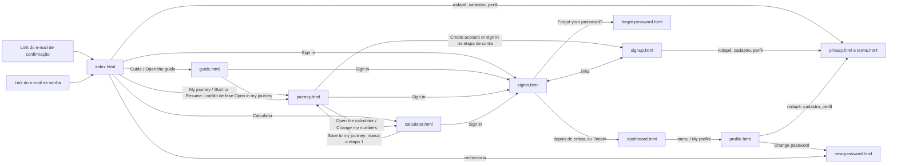
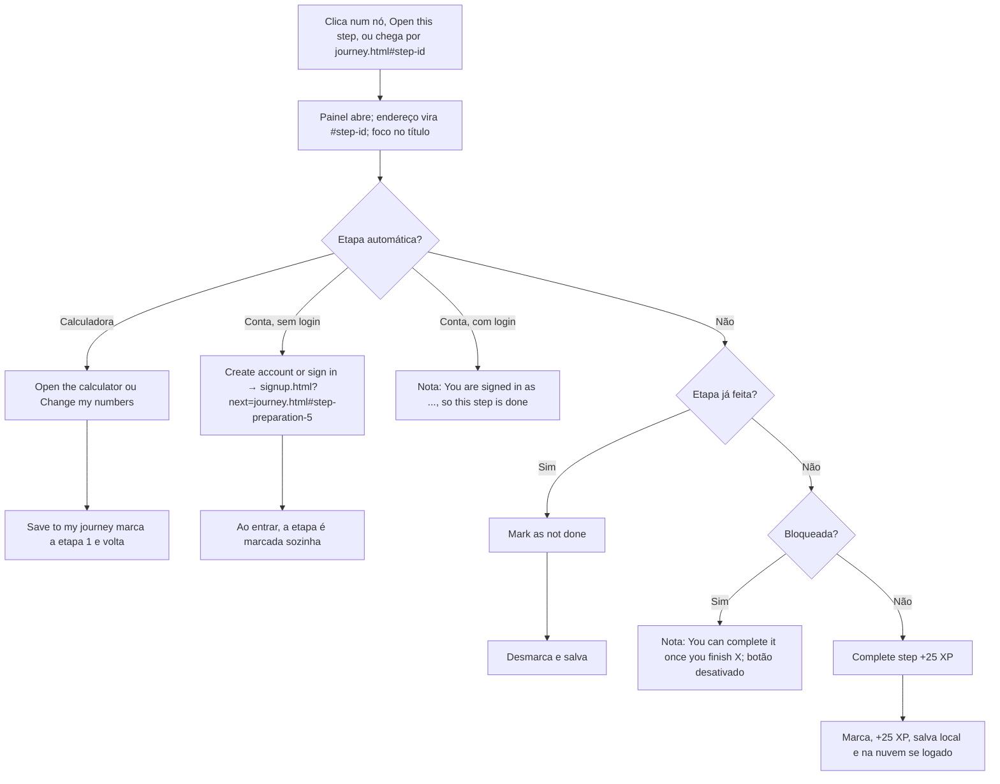
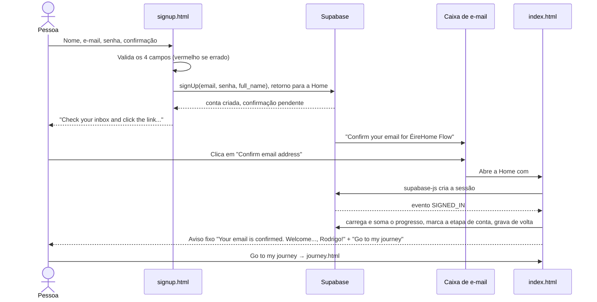
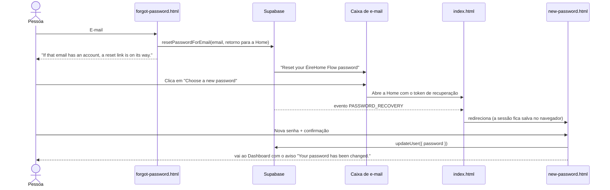

# App Flow

Produto: ÉireHome Flow · Versão do documento: 1.3 · Última revisão: 24/09/2026

Os diagramas usam Mermaid (renderizado no GitHub e no VS Code com a extensão de preview). Cada caixa com `.html` é uma página própria.

## 1. Mapa do site



## 2. Primeira visita

1. O visitante chega à Home. Sem progresso salvo, o botão diz "Start my journey".
2. Pode ler o guia completo (`guide.html`), usar a calculadora ou abrir a jornada, sem conta.
3. Na jornada, "Calculate my buying power" aparece como atual ("Start here"); as demais obrigatórias aparecem bloqueadas.
4. A etapa 1 só se conclui pela calculadora: "Open the calculator" → preenche → "Save to my journey" → volta à etapa 1 marcada, com os números da pessoa. Daí em diante, as etapas 2, 3 e 5 mostram os números dela.

## 3. Regra de desbloqueio

```
unlocked = quantidade de etapas, a partir da primeira, até achar a primeira obrigatória não feita
etapa i está:
  feita      se done[id]
  atual      se i == unlocked e não feita
  bloqueada  se i > unlocked
  disponível nos demais casos
```

- Etapas **opcionais** nunca bloqueiam as seguintes.
- A etapa **de conta** (`preparation-5`) é obrigatória: sem ela, nada da fase 2 em diante pode ser concluído.
- Etapas **automáticas** (`data-auto`) não têm "Complete step": a calculadora (`preparation-0`) é marcada ao salvar na jornada, e a de conta (`preparation-5`) ao entrar. A de conta é marcada mesmo que as anteriores ainda não estejam feitas; a trilha continua parada na primeira obrigatória pendente.
- Desmarcar uma etapa obrigatória anterior volta a bloquear as seguintes; as que já estavam feitas podem ser desmarcadas.
- Etapas automáticas não têm "Mark as not done". "Reset progress" limpa tudo, menos a etapa de conta de quem está logado.

## 4. Abrir e concluir uma etapa (journey.html)



"Close" fecha o painel, remove o `#step-...` do endereço e devolve o foco ao nó.

## 5. Criar conta



Se a confirmação de e-mail estiver desligada no Supabase, o cadastro já cria a sessão: aviso "Your account is ready..." e ida direta para o `next` (ou Dashboard).

## 6. Entrar

1. "Sign in" no topo abre `signin.html` (ou `signin.html?next=...` quando vem de uma página logada).
2. E-mail e senha (sem regra de força, para não travar contas antigas).
3. Com sucesso: o aviso "Welcome back, Rodrigo." é guardado para a próxima página, e a pessoa vai para o `next` ou para o Dashboard. Lá, o evento `INITIAL_SESSION` soma e sincroniza o progresso.
4. Com erro: mensagem do Supabase (ex.: "Invalid login credentials").

## 7. Esqueci a senha e troca de senha



Quem já está logado usa o mesmo `new-password.html` pelo botão "Change password" de My profile. Sem sessão, a página explica como pedir um novo link.

## 8. Menu da conta

1. Logado, o topo mostra o círculo com as iniciais.
2. Clique: abre o menu (nome, e-mail, Dashboard, My profile, Sign out). Para trocar a senha, a pessoa entra em My profile e usa "Change password".
3. Fecha com clique fora, Esc ou ao escolher uma opção.

## 9. Editar o perfil (profile.html)

1. O nome vem preenchido.
2. Nome inválido fica vermelho ("Enter your first and last name.").
3. "Save changes" grava `full_name` no Supabase; chega o evento `USER_UPDATED`, as iniciais do topo se atualizam e aparece "Your profile has been updated."

## 10. Sair

"Sign out" (menu ou Perfil) encerra a sessão e apaga o progresso deste navegador. O progresso continua na conta. No Dashboard, no Perfil e em Nova senha, a pessoa volta à Home com o aviso "You have signed out..."; nas outras páginas, o aviso aparece ali mesmo.

## 11. Pessoa que volta

- **Sem conta:** progresso e calculadora restaurados do `localStorage`; "Resume my journey".
- **Com conta, no mesmo navegador:** sessão restaurada (`INITIAL_SESSION`) e progresso somado com o da nuvem.
- **Com conta, em outro aparelho:** ao entrar, o progresso da nuvem aparece.

## 12. Casos de borda

| Caso | Comportamento |
|---|---|
| Aberto via `file://` | Header, footer e lista de etapas não carregam; o console explica que é preciso servir por HTTP |
| `localStorage` bloqueado | Funciona, mas o progresso dura só a visita |
| Biblioteca do Supabase não carrega | Contas desligadas nessa visita; páginas de conta e etapa de conta avisam |
| Link do e-mail expirado ou já usado | Home mostra aviso vermelho fixo e limpa o endereço |
| `?next=` com endereço estranho | Ignorado; só são aceitos nomes de página do próprio site (ex.: `journey.html#step-aip-0`) |
| Falha ao ler o progresso da nuvem ao entrar | A etapa de conta é marcada só neste navegador; nada é gravado na conta, para não apagar o progresso salvo lá |
| Etapa 1 feita sem os números neste navegador (marcada à mão antes, ou outro aparelho) | A jornada pede "Open the calculator and choose Save to my journey"; o Dashboard mostra "Not saved yet"; a calculadora mostra "Save to my journey" |
| Página logada acessada sem login | Cartão "Sign in to see this page..." com links que voltam para a página |
| Etapa aberta e página recarregada | O `#step-id` reabre a mesma etapa |
| Visitante com versão antiga em cache | Páginas carregam CSS e JS com `?v=` (página nova busca scripts novos); o guia e os partials são sempre conferidos com o servidor; os scripts toleram partes que faltam (ver TRD, seção 10) |
