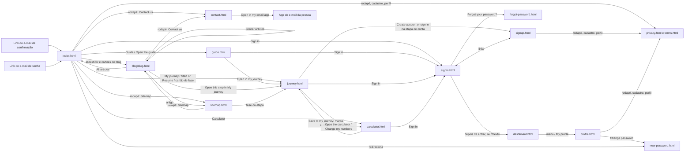
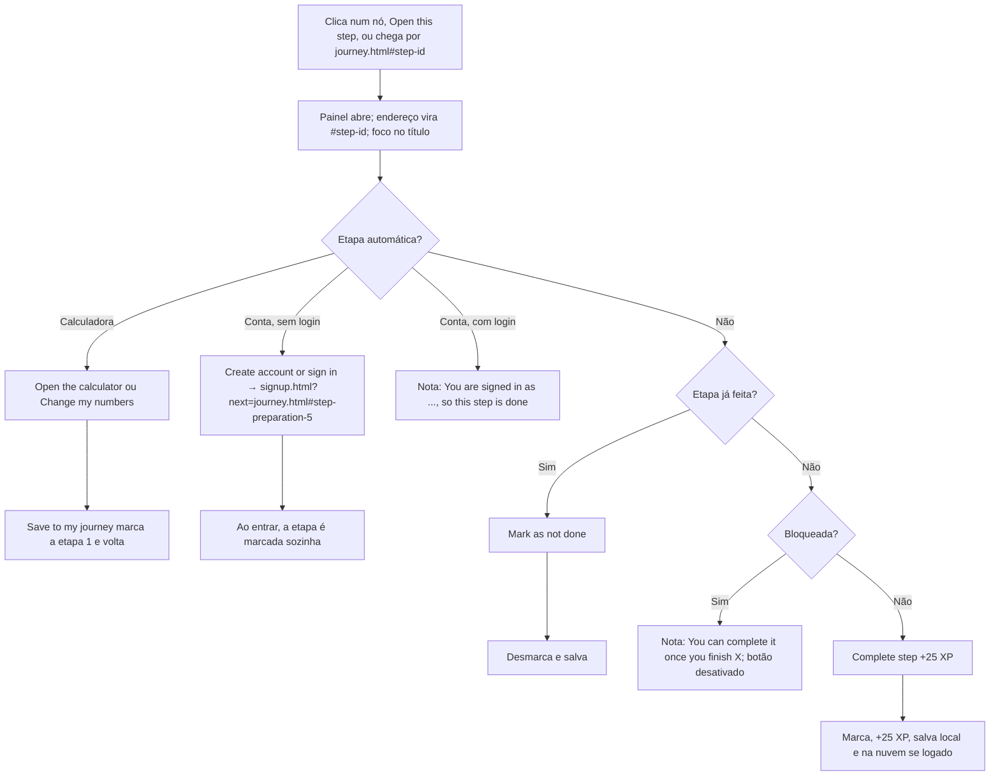
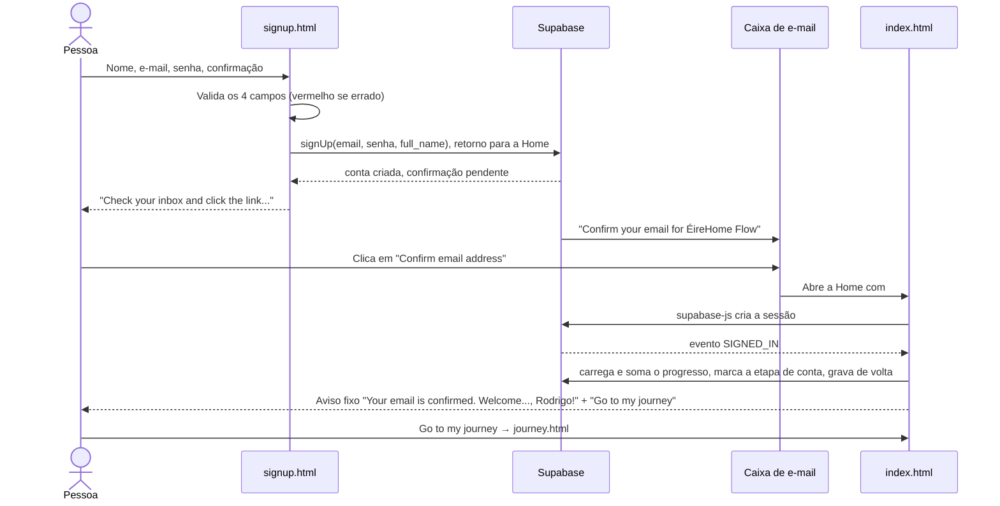
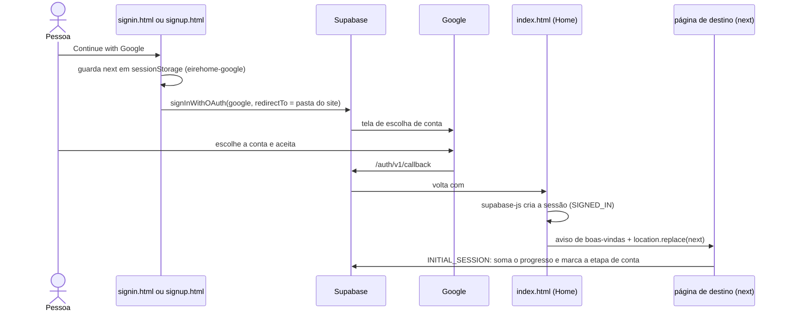
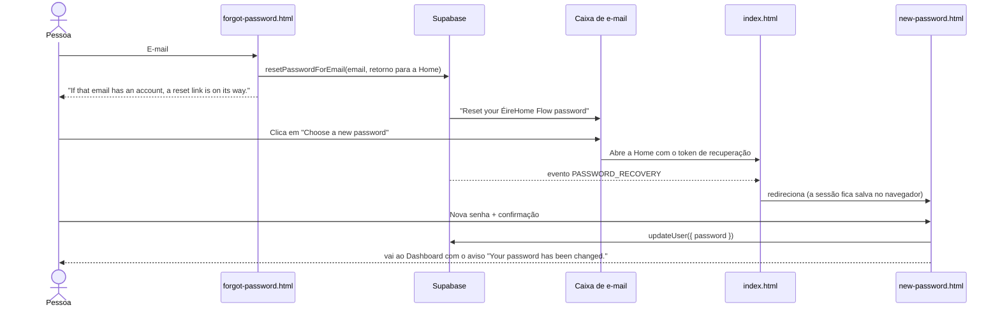
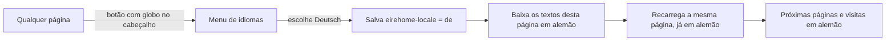

# App Flow

Produto: ÉireHome Flow · Versão do documento: 1.8 · Última revisão: 29/09/2026

Os diagramas usam Mermaid (renderizado no GitHub e no VS Code com a extensão de preview). Cada caixa com `.html` é uma página própria.

## 1. Mapa do site


```mermaid
flowchart LR
  H[index.html] -->|Guide / Open the guide| G[guide.html]
  H -->|My journey / Start or Resume / cartão de fase| J[journey.html]
  H -->|Calculator| C[calculator.html]
  G -->|Open in my journey| J
  C -->|Save to my journey: marca a etapa 1| J
  J -->|Open the calculator / Change my numbers| C
  J -->|Create account or sign in na etapa de conta| SU[signup.html]
  H & G & J & C -->|Sign in| SI[signin.html]
  SI <-->|links| SU
  SI -->|Forgot your password?| FP[forgot-password.html]
  SI -->|depois de entrar, ou ?next=| D[dashboard.html]
  D -->|menu / My profile| P[profile.html]
  P -->|Change password| NP[new-password.html]
  H & SU & P -->|rodapé, cadastro, perfil| LG[privacy.html e terms.html]
  H -->|slideshow e cartões do blog| B[blog/slug.html]
  B -->|Open this step in My journey| J
  B -->|Similar articles| B
  B -->|All articles| H
  H & B -->|rodapé: Contact us| CT[contact.html]
  H & B -->|rodapé: Sitemap| SM[sitemap.html]
  SM -->|fase ou etapa| J
  SM -->|artigo| B
  CT -->|Open in my email app| M[App de e-mail da pessoa]
  E1[Link do e-mail de confirmação] --> H
  E2[Link do e-mail de senha] --> H -->|redireciona| NP
```

## 2. Primeira visita

1. O visitante chega à Home, no idioma do navegador se o site o tiver completo (um dos 9 idiomas), senão em inglês. Nada é salvo: a detecção roda de novo a cada visita até a pessoa escolher um idioma no menu (seção 10.1). Sem progresso salvo, o botão diz "Start my journey".
2. Pode ler o guia completo (`guide.html`), usar a calculadora ou abrir a jornada, sem conta.
3. Na jornada, "Calculate my buying power" aparece como atual ("Start here"); as demais obrigatórias aparecem bloqueadas.
4. A etapa 1 só se conclui pela calculadora: "Open the calculator" → preenche → "Save to my journey" → volta à etapa 1 marcada, com os números da pessoa. Daí em diante, as etapas 2, 3 e 5 mostram os números dela.

## 3. Regra de desbloqueio

```
unlocked = quantidade de etapas, a partir da primeira, até achar a primeira obrigatória não feita
etapa i está:
  feita      se done[id]
  atual      se i == unlocked e não feita
  bloqueada  se i > unlocked
  disponível nos demais casos
```

- Etapas **opcionais** nunca bloqueiam as seguintes.
- A etapa **de conta** (`preparation-5`) é obrigatória: sem ela, nada da fase 2 em diante pode ser concluído.
- Etapas **automáticas** (`data-auto`) não têm "Complete step": a calculadora (`preparation-0`) é marcada ao salvar na jornada, e a de conta (`preparation-5`) ao entrar. A de conta é marcada mesmo que as anteriores ainda não estejam feitas; a trilha continua parada na primeira obrigatória pendente.
- Desmarcar uma etapa obrigatória anterior volta a bloquear as seguintes; as que já estavam feitas podem ser desmarcadas.
- Etapas automáticas não têm "Mark as not done". "Reset progress" limpa tudo, menos a etapa de conta de quem está logado.

## 4. Abrir e concluir uma etapa (journey.html)


```mermaid
flowchart TD
  S[Clica num nó, Open this step, ou chega por journey.html#step-id] --> O[Painel abre; endereço vira #step-id; foco no título]
  O --> Q0{Etapa automática?}
  Q0 -->|Calculadora| C1[Open the calculator ou Change my numbers] --> C2[Save to my journey marca a etapa 1 e volta]
  Q0 -->|Conta, sem login| A[Create account or sign in → signup.html?next=journey.html#step-preparation-5] --> A2[Ao entrar, a etapa é marcada sozinha]
  Q0 -->|Conta, com login| A3[Nota: You are signed in as ..., so this step is done]
  Q0 -->|Não| Q1{Etapa já feita?}
  Q1 -->|Sim| U[Mark as not done] --> U2[Desmarca e salva]
  Q1 -->|Não| Q2{Bloqueada?}
  Q2 -->|Sim| L[Nota: You can complete it once you finish X; botão desativado]
  Q2 -->|Não| K[Complete step +25 XP] --> K2[Marca, +25 XP, salva local e na nuvem se logado]
```

"Close" fecha o painel, remove o `#step-...` do endereço e devolve o foco ao nó.

## 5. Criar conta


```mermaid
sequenceDiagram
  actor P as Pessoa
  participant SU as signup.html
  participant SB as Supabase
  participant M as Caixa de e-mail
  participant H as index.html
  P->>SU: Nome, e-mail, senha, confirmação
  SU->>SU: Valida os 4 campos (vermelho se errado)
  SU->>SB: signUp(email, senha, full_name), retorno para a Home
  SB-->>SU: conta criada, confirmação pendente
  SU-->>P: "Check your inbox and click the link..."
  SB->>M: "Confirm your email for ÉireHome Flow"
  P->>M: Clica em "Confirm email address"
  M->>H: Abre a Home com #access_token...&type=signup
  H->>SB: supabase-js cria a sessão
  SB-->>H: evento SIGNED_IN
  H->>SB: carrega e soma o progresso, marca a etapa de conta, grava de volta
  H-->>P: Aviso fixo "Your email is confirmed. Welcome..., Rodrigo!" + "Go to my journey"
  P->>H: Go to my journey → journey.html#step-preparation-5
```

Se a confirmação de e-mail estiver desligada no Supabase, o cadastro já cria a sessão: aviso "Your account is ready..." e ida direta para o `next` (ou Dashboard).

## 6. Entrar

1. "Sign in" no topo abre `signin.html` (ou `signin.html?next=...` quando vem de uma página logada).
2. E-mail e senha (sem regra de força, para não travar contas antigas).
3. Com sucesso: o aviso "Welcome back, Rodrigo." é guardado para a próxima página, e a pessoa vai para o `next` ou para o Dashboard. Lá, o evento `INITIAL_SESSION` soma e sincroniza o progresso.
4. Com erro: mensagem do Supabase (ex.: "Invalid login credentials").

### 6.1 Entrar (ou criar conta) com Google


```mermaid
sequenceDiagram
  actor P as Pessoa
  participant S as signin.html ou signup.html
  participant SB as Supabase
  participant G as Google
  participant H as index.html (Home)
  participant N as página de destino (next)
  P->>S: Continue with Google
  S->>S: guarda next em sessionStorage (eirehome-google)
  S->>SB: signInWithOAuth(google, redirectTo = pasta do site)
  SB->>G: tela de escolha de conta
  P->>G: escolhe a conta e aceita
  G->>SB: /auth/v1/callback
  SB->>H: volta com #access_token
  H->>H: supabase-js cria a sessão (SIGNED_IN)
  H->>N: aviso de boas-vindas + location.replace(next)
  N->>SB: INITIAL_SESSION: soma o progresso e marca a etapa de conta
```

- A conta é criada no primeiro login com Google, já confirmada (não há e-mail de confirmação).
- Se o e-mail da conta Google já tiver conta com senha no site, o Supabase junta as duas no mesmo usuário (o e-mail do Google é verificado). O progresso é o mesmo.
- Cancelar no Google, ou qualquer erro, volta para a Home com aviso vermelho e o botão "Sign in".

## 7. Esqueci a senha e troca de senha


```mermaid
sequenceDiagram
  actor P as Pessoa
  participant FP as forgot-password.html
  participant SB as Supabase
  participant M as Caixa de e-mail
  participant H as index.html
  participant NP as new-password.html
  P->>FP: E-mail
  FP->>SB: resetPasswordForEmail(email, retorno para a Home)
  FP-->>P: "If that email has an account, a reset link is on its way."
  SB->>M: "Reset your ÉireHome Flow password"
  P->>M: Clica em "Choose a new password"
  M->>H: Abre a Home com o token de recuperação
  SB-->>H: evento PASSWORD_RECOVERY
  H->>NP: redireciona (a sessão fica salva no navegador)
  P->>NP: Nova senha + confirmação
  NP->>SB: updateUser({ password })
  NP-->>P: vai ao Dashboard com o aviso "Your password has been changed."
```

Quem já está logado usa o mesmo `new-password.html` pelo botão "Change password" de My profile. Sem sessão, a página explica como pedir um novo link.

## 8. Menu da conta

1. Logado, o topo mostra o círculo com as iniciais.
2. Clique: abre o menu (nome, e-mail, Dashboard, My profile, Sign out). Para trocar a senha, a pessoa entra em My profile e usa "Change password".
3. Fecha com clique fora, Esc ou ao escolher uma opção.

## 9. Editar o perfil (profile.html)

1. O nome vem preenchido.
2. Nome inválido fica vermelho ("Enter your first and last name.").
3. "Save changes" grava `full_name` no Supabase; chega o evento `USER_UPDATED`, as iniciais do topo se atualizam e aparece "Your profile has been updated."

## 9.1 Apagar a conta (profile.html)

1. "Delete my account" abre a confirmação na própria página; "Cancel" fecha.
2. "Yes, delete my account" chama `delete_my_account()` no Supabase: a conta, o progresso e as sessões são apagados.
3. Este navegador sai da conta (as figuras da calculadora ficam), e a pessoa vai à Home com "Your account and its saved progress have been deleted."
4. Outros aparelhos onde a pessoa estava logada perdem a sessão quando o token de acesso vence (em até 1 hora) e não conseguem mais gravar progresso.
5. Se der erro, a mensagem aparece abaixo dos botões e nada é apagado. Sem a função no banco: "Deleting accounts from the site is not switched on yet. Email...".

## 10. Sair

"Sign out" (menu ou Perfil) encerra a sessão e apaga o progresso deste navegador. O progresso continua na conta. No Dashboard, no Perfil e em Nova senha, a pessoa volta à Home com o aviso "You have signed out..."; nas outras páginas, o aviso aparece ali mesmo.

## 10.1 Trocar de idioma


```mermaid
flowchart LR
  A[Qualquer página] -->|botão com globo no cabeçalho| M[Menu de idiomas]
  M -->|escolhe Deutsch| S[Salva eirehome-locale = de]
  S --> B[Baixa os textos desta página em alemão]
  B --> R[Recarrega a mesma página, já em alemão]
  R --> N[Próximas páginas e visitas em alemão]
```

1. O menu lista só os idiomas completos, cada um no próprio nome. O atual vem marcado.
2. A escolha fica salva no navegador (`localStorage`) e vale para todas as páginas e visitas. A detecção pelo idioma do navegador nunca a substitui.
3. A página recarrega no mesmo lugar (a etapa aberta na jornada continua aberta, porque está no endereço). Formulário meio preenchido é perdido.
4. **Link com `?lang=`** (ex.: `index.html?lang=pt`): abre naquele idioma só nesta aba, sem mudar a escolha salva. Serve para mandar o site em português para alguém, e para revisar idiomas em rascunho (`?lang=<código>`).
5. Com o armazenamento bloqueado, a escolha não pode ser salva: a página recarrega com `?lang=` no endereço, e o idioma vale só para ela.

## 10.2 Ler um artigo do blog

1. Na Home, a seção do blog mostra 4 artigos no slideshow, 3 ao lado e o resto em "More articles", sorteados a cada visita. O blog é todo em inglês, qualquer que seja o idioma do site.
2. Clicar num slide ou cartão abre `blog/<slug>.html`.
3. No fim do artigo, a caixa "In My journey" leva à etapa ligada a ele (`journey.html#step-<id>`), que abre com o painel da etapa.
4. "Similar articles" abre outro artigo; "← All articles" volta ao blog na Home (`index.html#blog`).

## 10.3 Falar com o site (contact.html)

1. "Contact us" no rodapé de qualquer página abre `contact.html`. Logado, nome e e-mail já vêm preenchidos.
2. A pessoa escolhe o assunto e escreve a mensagem. Campo vazio ou e-mail inválido fica vermelho, e o foco vai ao primeiro.
3. "Open in my email app" abre o aplicativo de e-mail com a mensagem para eirehomeflow@gmail.com, assunto "ÉireHome Flow: <assunto>" e nome e e-mail no fim do texto. A página avisa que o aplicativo deve ter aberto e repete o endereço, para quem não tem aplicativo de e-mail configurado.
4. Nada é enviado nem guardado pelo site: a mensagem só sai quando a pessoa a envia no aplicativo.

## 10.4 Mapa do site (sitemap.html)

1. "Sitemap" no rodapé abre `sitemap.html`, com todas as páginas, as 6 fases e as 31 etapas e os 20 artigos.
2. Uma fase leva a `journey.html#phase-<slug>`; uma etapa abre em `journey.html#step-<id>`, com o painel aberto; um artigo abre `blog/<slug>.html`.
3. Para buscadores, `sitemap.xml` lista as páginas públicas e os artigos.

## 11. Pessoa que volta

- **Sem conta:** progresso e calculadora restaurados do `localStorage`; "Resume my journey". O idioma escolhido antes continua.
- **Com conta, no mesmo navegador:** sessão restaurada (`INITIAL_SESSION`) e progresso somado com o da nuvem.
- **Com conta, em outro aparelho:** ao entrar, o progresso da nuvem aparece.

## 12. Casos de borda

| Caso | Comportamento |
|---|---|
| Aberto via `file://` | Header, footer e lista de etapas não carregam; o console explica que é preciso servir por HTTP |
| `localStorage` bloqueado | Funciona, mas o progresso dura só a visita |
| Biblioteca do Supabase não carrega | Contas desligadas nessa visita; páginas de conta e etapa de conta avisam |
| Link do e-mail expirado ou já usado | Home mostra aviso vermelho fixo e limpa o endereço |
| `?next=` com endereço estranho | Ignorado; só são aceitos nomes de página do próprio site (ex.: `journey.html#step-aip-0`) |
| Falha ao ler o progresso da nuvem ao entrar | A etapa de conta é marcada só neste navegador; nada é gravado na conta, para não apagar o progresso salvo lá |
| Etapa 1 feita sem os números neste navegador (marcada à mão antes, ou outro aparelho) | A jornada pede "Open the calculator and choose Save to my journey"; o Dashboard mostra "Not saved yet"; a calculadora mostra "Save to my journey" |
| Página logada acessada sem login | Cartão "Sign in to see this page..." com links que voltam para a página |
| Etapa aberta e página recarregada | O `#step-id` reabre a mesma etapa |
| Primeira visita num idioma, sem cópia dos textos | A página fica escondida até os textos chegarem (no máximo 3 s; depois disso aparece em inglês). As páginas seguintes abrem na hora |
| Idioma escolhido virou rascunho | A escolha fica guardada, mas não vale: o site usa o idioma do navegador ou o inglês até o idioma voltar a ficar completo |
| Texto sem tradução num idioma em rascunho | Aparece em inglês |
| Visitante com versão antiga em cache | Páginas carregam CSS e JS com `?v=` (página nova busca scripts novos); o guia é sempre conferido com o servidor, e cabeçalho e rodapé vêm dentro de cada página; os scripts toleram partes que faltam (ver TRD, seção 10) |
